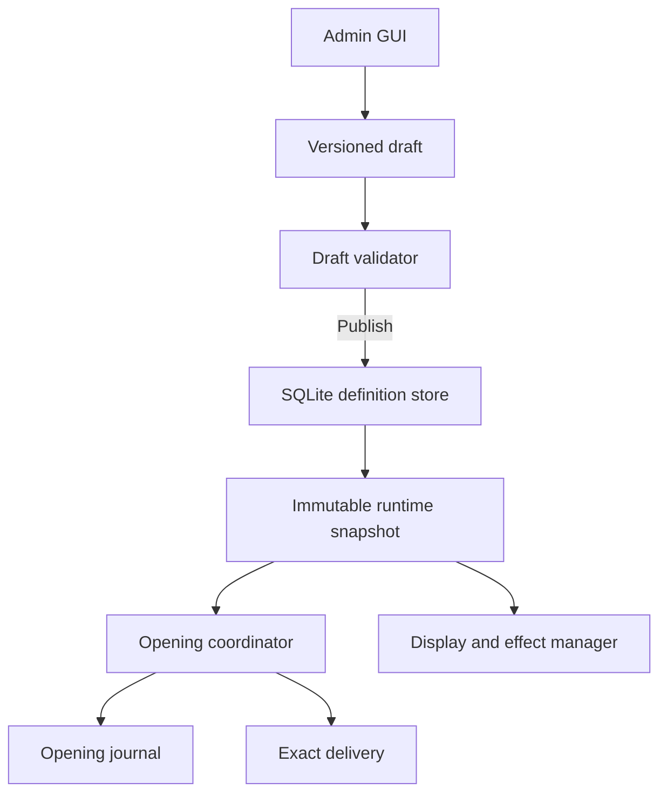
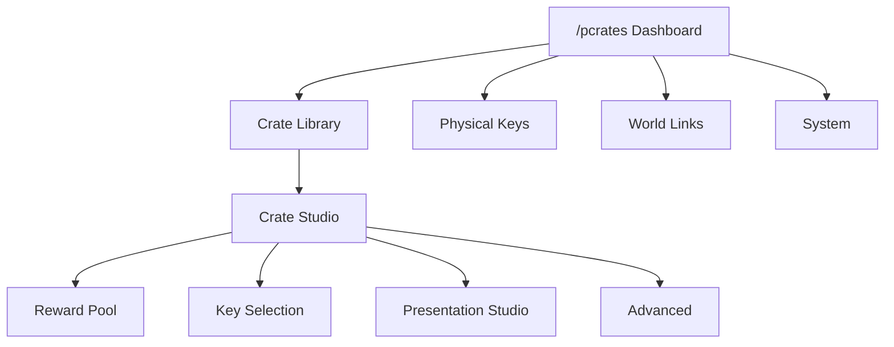
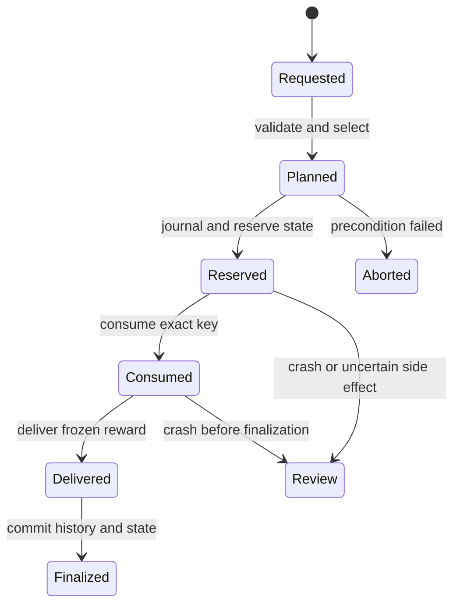

# PlexonCrates 3.0.0 — Stability, Simplicity, and Exact-Item Implementation Specification

> Complete development handoff for the 3.0 release  
> Project owner and creator: **Tonim (ZpkDxGames)**  
> Repository: <https://github.com/ZpkDxGames/PlexonCrates>  
> Target runtime: **Paper 26.2**, **Java 25**  
> Baseline: the released and tagged **PlexonCrates 2.0.0** source  
> Recommended development branch: `3.0-Update`

## 1. Purpose of this specification

PlexonCrates 2.0 established the correct safety foundation: exact physical keys, exact item rewards, journaled openings, SQLite runtime data, protected world links, atomic reloads, a complete API, and a GUI-first administration system. The 3.0 release must preserve those guarantees while substantially reducing the amount of knowledge and effort required to create a good crate.

The main 3.0 goal is not to add the greatest possible number of settings. It is to make the existing power reliable, understandable, and pleasant to use.

An administrator should be able to complete the most common workflow without reading documentation or entering a sequence of technical values:

1. Open `/pcrates`.
2. Create or select a crate.
3. Drag its exact key or select a live PlexonKeys key.
4. Open the reward pool.
5. Drag items directly from the inventory into empty reward slots.
6. See each item become a complete, usable reward immediately.
7. Adjust clear percentages instead of relative weights.
8. Select a polished crate-effect preset.
9. Preview the full crate.
10. Publish and link it to a world block.

No separate reward-ID prompt, bundle wizard, seven-value limits string, pipe-separated effect input, or manual probability formula should be required for this normal path.

This document is intentionally specific. A future implementation agent should treat every statement marked **must** as a release requirement unless Tonim explicitly changes it.

## 2. 2.0 findings and the 3.0 response

The 3.0 design must address the actual usability and stability problems observed after the 2.0 release.

| 2.0 friction | Why it is difficult | Required 3.0 response |
|---|---|---|
| Relative reward weights | Administrators must mentally convert shares into percentages and understand that every edit changes every other chance | Present and store base chances as percentages using exact basis points; rebalance automatically and visibly |
| One overloaded reward builder | Items, commands, XP, money, rarity, permissions, limits, messages, effects, order, and state compete on one page | Quick-add creates a complete reward immediately; optional details are separated into small focused pages |
| Reward ID required before adding an item | A technical identifier interrupts the natural drag-and-drop workflow | Generate a safe stable ID automatically; allow optional advanced renaming later |
| Dense chat inputs | Comma-separated limits and pipe-separated presentation fields are error-prone and hard to remember | One setting per control, preset buttons, validation at the point of input, and a clear back path |
| Too many visible configuration surfaces | Ordinary setup exposes internals that most administrators never need | Ship a minimal global configuration; keep fixed functional GUI layouts; expose advanced exports only on demand |
| Exact item capture is hidden inside a bundle workflow | Adding one custom item feels much more complicated than it should | Every empty reward slot is a direct, non-destructive drop target |
| GUI state is complex | Close, drag, double-click, hotbar, reload, and session edge cases can make editors feel unstable | Use a versioned server-side draft model, explicit input policies, ordered persistence, and exhaustive event tests |
| Cosmetic settings are fragmented | Animation, hologram, particles, sounds, title, broadcast, and reward effects do not feel like one design system | Introduce crate presentation profiles and effect presets with a safe preview mode |
| Advanced features dominate the core flow | Limits, pity, permission gates, bundles, and custom commands are valuable but uncommon | Use progressive disclosure: Essentials first, Advanced only when intentionally opened |
| YAML is both an editing surface and runtime source | Multiple live files increase validation, partial-write, and reload complexity | Make SQLite the canonical editable definition store; retain validated YAML import/export for portability |

## 3. Product vision

PlexonCrates 3.0 should feel like a premium first-party Paper feature rather than a configuration framework exposed through an inventory.

For players, the behavior remains direct:

- Obtain a real physical key from PlexonKeys or another configured source.
- Preview a crate and its currently eligible rewards.
- Open it through a linked block or the crate browser.
- Receive one exact, already-selected outcome safely.
- Enjoy a polished animation or effect without the cosmetic layer controlling delivery.

For administrators, the behavior becomes visual:

- Real items are the main input language.
- Percentages are the chance language.
- Presets are the presentation language.
- The GUI explains the next useful action.
- Details appear only after the administrator asks for them.
- Every edit is a recoverable draft until it is published.

The defining 3.0 promise is:

> **Drag the item, set the chance, choose the look, and publish. PlexonCrates handles the technical details safely.**

## 4. Non-negotiable principles

- Keep authorship as **Tonim (ZpkDxGames)** in metadata, source headers where present, documentation, manifests, and release notes.
- Continue from the exact `v2.0.0` tag. Do not rebuild the project from scratch and do not discard tested 2.0 safety behavior.
- Remain an independent MIT-licensed implementation. Do not copy ExcellentCrates code, assets, configuration, or text.
- Target Paper 26.2 and Java 25 for this release unless Tonim explicitly changes the target.
- Use Adventure MiniMessage for plugin-owned text. Do not introduce legacy `&` formatting.
- Keep PlexonKeys, Vault, and PlaceholderAPI optional integrations.
- Preserve exact custom-item data. Never reduce an item to material, name, lore, enchantments, or CustomModelData.
- Never modify, consume, clear, or replace the administrator's source item during capture.
- Never consume a physical key before every correctness-critical opening precondition succeeds.
- Never let an animation, particle, hologram, sound, title, firework, GUI close, or player disconnect choose or invalidate an outcome.
- Do not perform disk or database work in block-interaction, inventory-click, selection, animation-tick, or particle-tick hot paths.
- Do not scan worlds or force-load chunks to find crate locations.
- Do not use display name, lore, material, or GUI item appearance to route menu actions.
- A failed draft save or failed publish must never partially change the active crate.
- A cosmetic runtime failure must never duplicate, remove, or replace a delivered reward.
- Simplicity must be achieved through better defaults and progressive disclosure, not by weakening exactness or transaction safety.

## 5. Release scope

### 5.1 Required for 3.0.0

- A redesigned, compact administrator GUI with a consistent navigation footer and click language.
- A direct reward-pool editor where every empty reward slot accepts an exact item.
- Non-destructive cursor-click, shift-click, and drag-to-add reward capture.
- Exact round-trip support for Paper-serializable items from other plugins.
- Automatic reward IDs and sensible defaults so a captured item is immediately usable.
- A percentage-first chance system with no weights in the normal GUI.
- Exact `0.01%` chance precision using integer basis points.
- Predictable automatic redistribution that always explains what changed.
- A crate Presentation Studio with performant idle/opening effect presets.
- Non-destructive preview/test modes for reward delivery and crate effects.
- Versioned, autosaved, resumable administrative drafts.
- SQLite-backed canonical crate, key, reward, item, effect, and draft definitions.
- Validated YAML import/export for portability and manual backup.
- A safe, idempotent, reversible 2.0-to-3.0 migration.
- Preservation of every 2.0 crate, key, reward action, chance ratio, limit, pity rule, linked block, statistic, journal, and audit entry.
- A hardened opening state machine with explicit transaction stages and idempotency.
- Reduced first-run file/configuration surface.
- Complete diagnostics, audit history, tests, documentation, CI, release notes, JAR, and checksum.

### 5.2 Important quality improvements

- Undo for recent draft changes.
- Clear save state: `Saved`, `Saving…`, or `Save failed`.
- A read-only exact-item inspector showing item source, amount, serialized size, and fingerprint without exposing full NBT.
- Search and filtering for large reward pools.
- Reward duplication and movement between crates.
- Pool presets such as equal, rarity curve, and preserve-relative rebalance.
- Effect budgets and automatic viewer/chunk culling.
- A one-click healthy-system report for support requests.
- Compatibility/deprecation adapters for the 2.0 public API.

### 5.3 Explicitly out of scope

- A web dashboard.
- Redis or cross-server synchronization.
- Paid-key purchasing, storefronts, or monetization logic.
- NMS-only packet animations.
- Virtual-key balances replacing physical PlexonKeys items.
- World scanning to reconstruct deleted location records.
- Executing arbitrary scripts as rewards.
- Live collaborative editing by multiple administrators.
- Automatic modification of items owned by external plugins.
- Making every functional GUI slot configurable.

These features may be considered after 3.0, but none may delay or destabilize this release.

## 6. Compatibility baseline

All working 2.0 behavior must remain available unless this specification explicitly replaces only its administration surface.

The following behavior cannot regress:

- Default `basic`, `rare`, `epic`, and `legendary` crates.
- Automatic live PlexonKeys discovery and exact category-item resolution.
- Last-known-good and exact fallback key templates.
- Exact physical-key matching and deterministic multi-stack consumption.
- Permission-filtered previews matching the real selection pool.
- Item, command, XP-point, XP-level, Vault-money, and mixed bundle rewards.
- Player/global limits, cooldowns, pity, and safe bulk opening.
- Journaled opening history and recovery diagnostics.
- Player browser, preview, opening animations, holograms, particles, and sounds.
- Protected multiple world locations per crate.
- Atomic validation and active-snapshot replacement.
- Existing command aliases and permissions.
- Public API/events, with compatible adapters where signatures change.
- Reversible 1.0-to-2.0 migration history and current SQLite data.

The old 2.0 GUI may not remain as a hidden parallel editor. Maintaining two editing systems would multiply bugs. The 3.0 editor must import all existing data and become the only supported editor.

## 7. Intended experience

### 7.1 Five-minute administrator path

A new administrator should be able to create a working crate in five minutes:

1. Run `/pcrates` and select **Create Crate**.
2. Drag a chest or other desired icon into the crate-icon slot.
3. Choose a discovered PlexonKeys category or drag an exact custom key.
4. Open **Rewards** and shift-click inventory items into the reward grid.
5. Review the automatically balanced percentage bar.
6. Choose `Subtle`, `Magical`, `Premium`, or `None` from **Effects**.
7. Press **Preview**, then **Publish**.
8. Receive the selected Link Wand and click the intended world block.

At no point should the administrator need to know what a relative weight, PDC, item codec, database journal, or YAML path is.

### 7.2 Advanced path

An experienced administrator can intentionally open **Advanced** to configure:

- Reward permissions.
- Player/global limits.
- Pity/guarantees.
- Mixed action bundles.
- Command ordering.
- Custom effect phases.
- Additional accepted keys and key cost.
- World/access restrictions.
- Custom messages and broadcasts.
- Bulk behavior and cooldowns.
- YAML import/export.

Advanced settings must never be required to make a valid ordinary crate.

### 7.3 Player path

- Left-click a linked crate to preview.
- Right-click with a valid key to open once.
- Sneak-right-click to bulk-open when enabled.
- See the real eligible chance, not an unconditional configuration percentage.
- Receive an exact item even if the opening GUI is closed.
- Never lose a key on validation, capacity, permission, cancellation, integration, or preparation failure.

## 8. High-level architecture

3.0 should retain the proven service separation of 2.0 but introduce a durable definition repository and a single draft/publish pipeline.



Required boundaries:

- `DefinitionRepository` — canonical crate, reward, key, item, and effect persistence.
- `DraftRepository` — versioned edits, revisions, undo entries, and save state.
- `DefinitionPublisher` — validates a draft, commits a complete definition transaction, and builds a replacement snapshot.
- `RuntimeSnapshot` — immutable active definitions used by player interactions.
- `ItemSnapshotCodec` — exact Paper item serialization, size validation, fingerprinting, and restoration.
- `ChanceAllocator` — basis-point invariants, redistribution, migration, and display calculations.
- `GuiRouter` — server-owned session and action routing.
- `GuiInputPolicy` — explicit handling of every inventory click/drag mode.
- `PresentationService` — effect profiles, presets, preview, budgets, and viewer-aware execution.
- `OpeningCoordinator` — locks, selection, reservation, journaling, consumption, delivery, and finalization.
- `KeyRegistry` / `PhysicalKeyProvider` — current live PlexonKeys architecture.
- `LocationService` — indexed database-backed links and protection.
- `AuditService` — administrator edits, publish revisions, and recovery information.

The active player runtime must never read a partially edited draft.

## 9. Canonical storage model

### 9.1 3.0 ownership

SQLite becomes authoritative for mutable definitions edited through the GUI:

- Crates and lifecycle state.
- Reward definitions and ordering.
- Exact reward item snapshots.
- Captured key definitions/templates.
- Crate presentation/effect profiles.
- Drafts and revisions.
- Linked locations.
- Statistics, history, limits, pity, journals, audit, and migration state.

YAML remains important, but it becomes a deliberate interchange format:

- `/pcrates export <crate>` creates a readable, versioned crate export.
- `/pcrates import <file> <new-id>` validates and creates a draft.
- A full backup includes SQLite plus generated YAML manifests.
- YAML is never silently live-reloaded into the active runtime.

This removes multi-file partial-write behavior and makes a publish operation one database transaction.

### 9.2 First-run layout

```text
plugins/PlexonCrates/
├── config.yml
├── messages.yml
├── data/
│   └── plexoncrates.db
├── backups/
├── exports/
├── imports/
└── logs/
```

`menus.yml`, `keys.yml`, and `crates/*.yml` should not be generated on a fresh 3.0 install. Safe defaults live in the JAR and are imported into SQLite once.

Advanced administrators may explicitly run:

- `/pcrates system export-theme` to create an optional cosmetic `theme.yml`.
- `/pcrates export <crate>` for crate YAML.
- `/pcrates keys export` for key YAML.

Functional slots and action identifiers remain code-defined even when cosmetic theme overrides exist.

### 9.3 Suggested definition tables

The exact SQL naming may vary, but the data model must include equivalent responsibilities:

| Table | Responsibility |
|---|---|
| `crate_definition` | Stable crate identity, lifecycle, access, opening settings, revision |
| `reward_definition` | Reward identity, display, chance basis points, ordering, eligibility, limits |
| `reward_item` | One exact serialized item template plus delivery amount and fingerprint |
| `reward_action` | Ordered command, XP, level, money, or future typed actions |
| `key_definition` | Captured/configured/provider-backed key metadata |
| `key_template` | Current/fallback/legacy exact key snapshots |
| `effect_profile` | Idle and opening presentation settings or preset reference |
| `draft` | Draft target, owner, base revision, current revision, save status |
| `draft_revision` | Bounded undo history and summarized before/after data |
| `location` | Indexed world UUID/name and block coordinates |
| `opening_journal` | Durable correctness state machine |
| `opening_history` | Completed outcome history |
| `reward_state` | Limits, reset windows, cooldowns, pity counters |
| `statistics` | Player/global counts |
| `audit` | Administrative actions and publication revisions |
| `schema_migration` | Idempotent version history and migration checksum |

Use foreign keys, unique constraints, WAL mode, prepared statements, and explicit transactions.

### 9.4 Runtime snapshots

On enable and after publish:

1. Read all published definitions on the database worker.
2. Deserialize item snapshots on the primary thread where Paper object access requires it.
3. Validate all cross-references and optional integration requirements.
4. Build an immutable `RuntimeSnapshot`.
5. Atomically replace one active reference.
6. Reconcile displays from the new snapshot without duplicating entities/tasks.

If any step fails, keep the previous healthy snapshot active and report the failed revision.

## 10. Exact-item preservation contract

Exact custom-item preservation is a release-defining feature, not a best-effort convenience.

### 10.1 Data that must survive

For every captured reward item or custom key, preserve everything Paper preserves, including:

- Namespaced material and amount.
- Adventure display name and lore.
- Enchantments, flags, attributes, damage, unbreakable state, glint, rarity, and tooltip settings.
- CustomModelData and modern item components.
- PersistentDataContainer keys and values.
- Custom NBT exposed through Paper serialization.
- Potion, book, map, banner, firework, trim, skull/profile, food, tool, weapon, armor, and block-state data.
- Bundle, container, and shulker contents.
- Plugin-specific identity written by Slimefun, ExecutableItems, ItemsAdder, Oraxen, MMOItems, Nexo, EcoItems, or similar plugins.
- Any future Paper-supported component carried by the `ItemStack` serializer.

Never rebuild a captured item manually from visible properties.

### 10.2 Capture representation

For a reward item:

- Clone the administrator's `ItemStack` on the primary thread.
- Record the stack amount as the default delivery amount.
- Normalize a separate template clone to amount `1` only for storage/delivery splitting.
- Serialize through Paper's supported item byte serialization API.
- Store the byte payload as a BLOB, not a lossy configuration map.
- Store material, captured amount, serialized size, data version if available, and SHA-256 fingerprint as diagnostics metadata.
- Do not use Java native object serialization.

For a physical key:

- Normalize the exact template amount to `1` before fingerprinting/matching.
- Retain current, explicit fallback, and administrator-approved legacy snapshots separately.

### 10.3 Load behavior

- Deserialize the stored bytes through the matching Paper API.
- Never silently strip unknown data and overwrite the original BLOB.
- If an external plugin is absent or an item cannot be restored, preserve the payload unchanged and mark the reward/key `UNAVAILABLE` with a diagnostic.
- The rest of the plugin may remain enabled when one reward is unavailable, but the affected crate cannot publish with no reachable reward pool.
- Once the dependency returns, a validate/reload may restore availability without recapturing the item.

### 10.4 Compatibility promise

PlexonCrates can guarantee exact preservation for data contained in the Paper `ItemStack`. It cannot guarantee behavior that an external plugin stores only in its own database and does not identify on the item. The GUI should explain this distinction without claiming universal integration.

### 10.5 Exact-item inspector

The item detail screen should provide a safe **Inspect Exact Item** action showing:

- Material.
- Delivery amount.
- Serialized byte size.
- Short fingerprint, such as the first 12 SHA-256 characters.
- Whether PDC/custom data is present.
- Whether container contents are present.
- Current decode status.
- Capture/update timestamp.

Do not print raw NBT/PDC values to normal chat or logs.

## 11. Administrator draft and session model

### 11.1 Drafts are the only edit target

Opening a published crate for editing creates or resumes a draft based on its current published revision. GUI clicks mutate only that draft. Players continue using the unchanged published snapshot until the administrator presses **Publish Changes**.

This prevents half-complete chance pools, missing keys, or temporary effect settings from affecting live openings.

### 11.2 Draft properties

Every draft needs:

- Stable draft UUID.
- Target type and ID.
- Owner UUID and last-known name.
- Base published revision.
- Monotonic draft revision.
- Created/updated timestamps.
- Save state.
- Validation status.
- Bounded undo history.
- Optional takeover metadata.

### 11.3 Ordered persistence

- Each edit receives a monotonically increasing sequence number.
- Writes for one draft execute in order on the bounded database worker.
- A later edit may never be overwritten by completion of an earlier asynchronous save.
- The GUI renders immediately from server-owned in-memory state and shows `Saving…` until the matching revision is durable.
- Publish remains disabled while a save is pending or failed.
- A failed save keeps the in-memory draft, shows a retry control, and never mutates the active definition.
- On inventory close or disconnect, the draft remains resumable.
- On shutdown, attempt a bounded flush and log any draft revision that could not be persisted.

### 11.4 Concurrent administrators

Only one administrator may hold the writable lease for a specific crate draft.

- A second administrator opens a read-only view with the current editor's name.
- With a dedicated permission, the second administrator may request takeover.
- Takeover requires confirmation, records an audit entry, increments the lease token, and invalidates stale GUI actions from the old session.
- A stale session must never publish over a newer revision.

### 11.5 Undo

- Keep at least the latest 20 structural draft revisions.
- Add, delete, move, chance edit, key replacement, and effect-profile change are undoable.
- Test delivery, preview, navigation, search, and pagination are not revisions.
- Undo creates a new forward revision; it does not delete audit history.
- Undo never affects a currently published version until republished.

## 12. GUI design system

### 12.1 Design goals

- Clean and compact rather than filled with decorative controls.
- One clear purpose per screen.
- No screen should require memorizing hidden click combinations.
- Frequently used actions occupy obvious positions.
- Advanced actions are reachable but visually secondary.
- The player's real inventory remains visible on item-input screens.
- The actual captured item remains visually intact in its reward slot.
- Every page has a consistent footer guide.

### 12.2 Stable interaction language

| Interaction | Meaning |
|---|---|
| Left-click | Open or perform the primary action |
| Right-click | Preview or open quick options |
| Shift-left-click | Fast add/select where explicitly shown |
| Shift-right-click | Begin a destructive action, always followed by confirmation |
| Middle-click | Optional exact numeric/text entry shortcut when supported |
| Drag/cursor-click into an empty input slot | Copy the exact held item non-destructively |
| Back button | Return to the exact previous screen and page |
| Barrier | Close/cancel current transient action, never delete a saved draft |

Every functional item should include only the interaction hints it actually supports.

### 12.3 Navigation footer

All six-row editors should reserve a stable bottom row:

| Slot | Standard role |
|---:|---|
| 45 | Page previous or context-specific secondary action |
| 46 | Search/filter or Undo |
| 47 | Previous page |
| 48 | Back |
| 49 | Guide/status |
| 50 | Preview/test |
| 51 | Next page |
| 52 | Advanced/details |
| 53 | Save/publish/close according to context |

Not every screen needs every item, but a role should not move arbitrarily between screens.

### 12.4 GUI data safety

- Use a custom `InventoryHolder` carrying session UUID, view kind, target ID, page, and lease token.
- Use server-owned slot-to-action mappings.
- PDC action tags may support debugging but must not be the only authority.
- Never infer an action from material, name, lore, slot alone, or a client-returned display item.
- Reject clicks from stale session IDs/revisions with a concise reopen message.
- Build display items from immutable view models.
- Do not store live editable data inside inventory item metadata.

### 12.5 Text input

Avoid chat input for common settings. When exact free text or a number is necessary:

- Close or suspend the GUI safely.
- Show one precise question and the current value.
- Accept `/cancel`.
- Validate immediately with a human-readable example.
- Reopen the same screen and page after success or cancellation.
- Time out after 60 seconds by default without deleting the draft.
- Intercept only the editing player's next valid response.
- Never broadcast intercepted input.

No input may require an undocumented comma- or pipe-separated tuple.

## 13. Simplified GUI map



Statistics should be accessible from the dashboard status/guide item and individual crate detail, rather than occupying a large primary dashboard tile. Global reward browsing should be reachable through the Crate Library filter rather than a separate top-level destination.

### 13.1 Dashboard

The dashboard should show only:

- **Crates** — create and manage crates.
- **Keys** — PlexonKeys discovery and captured keys.
- **World Links** — inspect links and obtain a wand.
- **System** — health, backups, import/export, validation, and diagnostics.
- **Status/Guide** — counts, integration health, and help.

If the system has errors, the System item becomes red and states the number of actionable errors. Healthy systems use a quiet green indicator.

### 13.2 Crate Library

Each crate card shows:

- Actual crate icon.
- Display name.
- Lifecycle state.
- Number of rewards.
- Base chance health (`100.00%` or incomplete).
- Key status.
- Number of world links.
- Draft/save warning when present.

Interactions:

- Left-click: open/resume Crate Studio.
- Right-click: player-style preview.
- Shift-left-click: duplicate into a new draft.
- Shift-right-click: archive/delete flow.

### 13.3 Crate Studio

The default Crate Studio should contain five prominent controls:

1. **Identity** — icon, name, description.
2. **Key** — accepted physical key and cost summary.
3. **Rewards** — reward count and `100.00%` health.
4. **Effects** — selected presentation preset and preview.
5. **World Links** — selected wand and link count.

Secondary controls:

- **Player Preview**.
- **Undo**.
- **Advanced**.
- **Publish Changes**.
- **Back**.

Do not show every cooldown, bulk, permission, hologram, command, limit, pity, and effect value on this page.

## 14. Guided crate creation

Creating a crate begins as a durable draft and uses the same Crate Studio as editing. Do not implement a separate fragile wizard architecture.

### 14.1 Start

The Create button asks only for a stable crate ID. Offer a suggested ID generated from the eventual display name, but validate:

- Lowercase `[a-z0-9][a-z0-9_-]{0,63}`.
- Case-insensitive uniqueness.
- No path separators or traversal.
- No reserved identifiers.

After the ID is accepted, create the durable draft immediately.

### 14.2 Sensible defaults

A new crate receives:

- `DRAFT` lifecycle.
- Chest icon.
- Humanized display name from the ID.
- Empty description.
- No required custom permission.
- All configured worlds allowed.
- Key cost `1`.
- Single opening enabled.
- Bulk opening enabled with global safe maximum.
- Cooldown `1` second.
- `ROULETTE` or configured default animation.
- `SUBTLE` presentation preset.
- Empty reward pool.
- Pity, reward limits, broadcasts, and advanced restrictions disabled.

### 14.3 Completion guide

The status item lists only incomplete required steps:

- Select a resolvable key.
- Add at least one available reward.
- Make the base chance total `100.00%`.
- Resolve any exact-item decode failure.

Identity, effects, limits, and locations have valid defaults and should not block an ordinary draft unless deliberately made invalid.

## 15. Direct drag-to-add reward experience

This is the highest-priority 3.0 usability feature.

### 15.1 Reward Pool screen

- Use a six-row inventory with up to 28 visible reward slots plus pagination.
- Every empty reward slot is a real input target.
- Occupied slots show the exact captured item or the typed action's natural icon.
- Do not append PlexonCrates chance/configuration lore to the actual captured-item display copy.
- Show pool percentage health, reward count, and save state on a separate status item.
- A footer guide explains: `Drag or shift-click an item to add it. Your item is copied, never moved.`

### 15.2 Accepted add methods

Support all of these:

1. Pick up an item on the cursor and click an empty reward slot.
2. Shift-click an item from the player's inventory; use the next empty reward slot.
3. Drag a cursor item across one or more empty reward slots; capture the original cursor stack once into the lowest valid target.
4. Use a dedicated **Add Special Reward** control for command, XP, levels, or money.

The source stack must remain byte-for-byte and amount-for-amount unchanged.

### 15.3 Immediate result

Adding one item performs all of the following without opening another required wizard:

- Capture the exact item.
- Use the captured stack amount as the delivery quantity.
- Generate a unique stable reward ID.
- Use the item's custom display name, or a humanized material name, as the reward display name.
- Mark the reward enabled.
- Set rarity to `COMMON` as a visual default only.
- Assign a safe default chance and rebalance the pool.
- Append it to the visible order.
- Save a draft revision.
- Show a short success message including its new base chance.

The administrator may continue dragging more items immediately.

### 15.4 Automatic reward IDs

Use a readable prefix plus a collision-resistant suffix, for example:

```text
diamond_sword_a7f2
slimefun_item_31bd
command_reward_09ce
```

The ID is internal and stable after creation. It should not be shown in normal card lore. The Advanced detail page may allow changing it only while the crate is still unpublished and no history/reference exists.

### 15.5 Occupied-slot behavior

- Dropping onto an occupied reward slot must not replace or merge it silently.
- Cancel the movement and open that reward's Quick Details, or show `Choose an empty slot to add; click this reward to edit.`
- Dragging across occupied and empty slots captures once into the first empty slot.
- If no visible/free logical slot exists, move to/create the next page and add there, or show a clear pool-capacity message.

### 15.6 Input event hardening

Explicitly test and handle:

- Normal left/right cursor clicks.
- Shift transfers.
- `InventoryDragEvent` with one or many raw slots.
- Number-key/hotbar swap.
- Offhand swap.
- Double-click collect-to-cursor.
- Drop-key and control-drop.
- Creative clone and creative inventory actions.
- Pickup-all, move-to-other-inventory, hotbar-move-and-readd, and unknown actions.
- Closing during a capture.
- Disconnect, death, teleport, reload, and disable while the editor is open.

Unknown or unsafe actions are canceled. Because capture is copy-only, no recovery path should ever need to return an item to the administrator.

## 16. Reward Quick Details

Left-clicking a reward opens a small, focused screen.

Required primary controls:

- **Exact Item** — untouched preview and inspector.
- **Chance** — base percent and current preview percent.
- **Amount** — delivery count, with safe stack splitting.
- **Name** — player-facing reward name.
- **Enabled** — toggle.
- **Test Reward** — deliver to the administrator without a key, history, statistics, limits, or pity.
- **More Options** — opens advanced reward settings.
- **Duplicate**.
- **Delete** — confirmation required.
- **Back**.

Changing reward amount must alter only the explicit delivery quantity. It must not reconstruct or mutate the stored exact template.

## 17. Reward model

3.0 should retain composable rewards internally while making the common one-item case effortless.

### 17.1 Typed actions

Each reward contains an ordered list of typed delivery actions:

- `ITEM` — exact template plus total amount.
- `COMMAND` — one validated console command.
- `EXPERIENCE_POINTS`.
- `EXPERIENCE_LEVELS`.
- `MONEY` — requires Vault and an active economy provider.

A normal drag creates one reward containing one `ITEM` action. An administrator may add more actions through **More Options → Reward Contents**, turning it into a bundle without changing its stable reward ID or chance.

### 17.2 Availability

A reward is selectable only when:

- It is enabled.
- Its chance is positive.
- Its required permission passes and blocked permission does not.
- Its limits/cooldown allow it.
- Every required integration is available.
- Every exact item decodes successfully.
- Every action validates.

The player preview and selection must use the same eligibility object from the same runtime snapshot.

### 17.3 Commands

- Commands execute as console.
- Do not include a leading `/`.
- Reject newlines, carriage returns, null characters, and control characters.
- Keep explicit order.
- Show one command per GUI entry.
- Add/edit one command at a time; never use a delimiter-based command list.
- Preview resolved built-in placeholders before saving when possible.

Built-in placeholders remain:

- `%player%`
- `%display_name%`
- `%uuid%`
- `%crate%`
- `%crate_id%`
- `%reward%`
- `%reward_id%`
- `%world%`
- `%x%`, `%y%`, `%z%`

PlaceholderAPI expansion occurs only when installed and enabled.

### 17.4 XP and money

- Use separate **XP Points**, **XP Levels**, and **Money** actions.
- Never require administrators to encode XP as commands.
- Validate finite, bounded numeric values.
- A money action becomes unavailable—not silently skipped—when Vault/economy is absent.
- The GUI provides a direct dependency status and a link back to diagnostics.

## 18. Percentage-first chance system

### 18.1 Replace weights in the normal model

The normal 3.0 schema and GUI store/display **base chance percent**, not relative weight.

Use integer basis points:

```text
100.00% = 10,000 basis points
  1.00% =    100 basis points
  0.01% =      1 basis point
```

This avoids floating-point drift and guarantees that a complete pool totals exactly `10,000`.

### 18.2 Runtime selection

For the current player:

1. Start with enabled rewards whose base chance is greater than zero.
2. Remove ineligible rewards using permissions, limits, cooldowns, and integration/item availability.
3. If pity/guarantee overrides the pool, build the guarantee pool explicitly.
4. Renormalize the remaining basis points into an exact `10,000`-ticket eligible distribution using the stable largest-remainder algorithm.
5. Draw one unbiased integer ticket.

The configured/base chance and current eligible chance are different concepts. The UI must label them clearly.

Example:

| Reward | Base chance | Player eligibility | Current chance |
|---|---:|---:|---:|
| Stone | 70.00% | Eligible | 77.78% |
| Diamond | 20.00% | Eligible | 22.22% |
| VIP item | 10.00% | Ineligible | Hidden/locked |

The two eligible values are renormalized to `77.78%` and `22.22%`, totaling exactly `100.00%`. The final integer ticket allocation must also total exactly `10,000`; display rounding must never be reused as selection input.

### 18.3 New reward allocation

When a reward is added:

- If it is the first reward, give it `100.00%`.
- Otherwise give it `min(10.00%, 100.00% / newRewardCount)`.
- Scale existing positive chances proportionally into the remaining basis points.
- Use stable largest-remainder rounding by reward order then ID.
- Show a message such as `Diamond Sword added at 10.00%; existing chances were scaled proportionally.`
- Make the entire change one undoable revision.

This preserves the relative relationship of existing rewards while giving the new reward a useful, visible chance. The administrator can immediately choose another value.

### 18.4 Editing one chance

The chance editor must provide:

- `-5%`, `-1%`, `-0.10%`, `+0.10%`, `+1%`, and `+5%` buttons.
- **Set Exact Percentage** input.
- **Lock/Unlock** for pool-balancing tools.
- Base and current eligible preview values.
- A distribution bar or compact list of the largest chances.

When setting reward A to a new value:

1. Clamp/validate between `0.00%` and `100.00%`.
2. Reserve A's requested basis points.
3. Redistribute the difference proportionally across other unlocked, positive rewards.
4. If proportional redistribution is impossible, ask the administrator to unlock rewards or use a pool preset.
5. Ensure the final sum is exactly `10,000`.
6. Present a short summary of what changed.

Never silently allow a published pool totaling `99.99%` or `100.01%`.

### 18.5 Pool tools

The Reward Pool footer includes **Balance Chances** with:

- **Preserve Relative** — correct rounding/gaps while retaining ratios.
- **Equal Chances** — all eligible configured rewards equal.
- **Rarity Curve** — apply an explicit documented preset based on visual rarity.
- **Normalize Unlocked** — keep locked values, divide the remainder among unlocked rewards.
- **Reset Last Change** — undo.

Every preset displays a before/after preview and requires confirmation when it materially changes more than one existing reward.

### 18.6 Zero-chance rewards

- A draft may contain a `0.00%` reward for preparation.
- It is not selectable and is labeled `Not in pool`.
- A published crate may retain disabled/zero-chance rewards, but must have at least one reachable positive-chance reward.
- Zero chance is never treated as a tiny fallback chance.

### 18.7 Statistical correctness

- Use a bounded unbiased integer random source.
- Selection boundaries must use exact integers, not accumulated doubles.
- Unit-test every boundary ticket.
- Property-test thousands of random pools for total, order, and reachability invariants.
- Run statistical smoke tests with deterministic seeds and reasonable tolerance; do not use flaky live randomness in CI.

## 19. Rarity and chance are separate

Rarity is a visual/organizational label. It must not secretly alter chance.

Default labels:

- `COMMON`
- `UNCOMMON`
- `RARE`
- `EPIC`
- `LEGENDARY`
- `MYTHIC`

Rarity may control preview color, announcement defaults, or effect suggestions. Only pressing the explicit **Rarity Curve** pool tool may derive chances from rarity.

This prevents an administrator from changing a color badge and unknowingly changing the economy.

## 20. Limits, permissions, and guarantees

These features remain supported but move behind **More Options**.

### 20.1 Permissions

Use a focused screen with:

- Required permission.
- Blocked permission.
- Clear/reset buttons.
- Current administrator test result.

Each field is edited separately. Empty means no restriction.

### 20.2 Limits

Use one control per setting:

- Player lifetime maximum.
- Player rolling-window maximum and window duration.
- Global lifetime maximum.
- Global rolling-window maximum and duration.
- Per-player reward cooldown.

All are disabled by default. The screen should summarize only active limits. Never request seven comma-separated values.

Provide simple presets:

- Once per player.
- Once per day per player.
- Once per week per player.
- Global one-time reward.
- Clear all limits.

### 20.3 Pity/guarantees

Pity is configured at the crate level through a dedicated **Guarantee** page:

- Disabled by default.
- Threshold number of unsuccessful openings.
- Eligible reward IDs and/or minimum rarity.
- Whether administrative openings count.
- Whether bulk selection applies sequentially and resets at the exact winning index.
- Preview explanation using a sample counter.

Never hide a pity override inside the normal displayed percentage. The preview must say when a guarantee is currently active or approaching.

## 21. Physical keys and PlexonKeys

### 21.1 Default behavior

PlexonKeys remains the recommended physical-key source and a soft dependency.

On first run, automatically discover and bind:

- `basic`
- `rare`
- `epic`
- `legendary`

Custom PlexonKeys categories appear in the Key Selection page automatically.

### 21.2 Resolution order

For a PlexonKeys-backed key:

1. Live exact category template.
2. Last-known-good exact template.
3. Bundled or imported exact fallback.
4. Unresolved.

Never fall back to material/name/lore comparison.

### 21.3 Key Selection screen

The normal Crate Studio key screen shows:

- Resolved live PlexonKeys categories first.
- Captured PlexonCrates keys second.
- Unresolved/disabled keys last with a diagnostic marker.
- Current accepted key and cost.
- A single **Capture Custom Key** drop target.

Selecting one key should return directly to Crate Studio. Additional accepted keys and costs greater than one belong under Advanced.

### 21.4 Custom key capture

Custom key capture uses the same copy-only input architecture as reward capture:

- Cursor-click, shift-click, or drag one exact item.
- Normalize only amount to `1`.
- Automatically generate a safe key ID, then optionally allow editing before publication.
- Show exact fingerprint and collision result.
- Never alter the source item.
- Reject PlexonCrates GUI controls and Link Wands.

### 21.5 Template changes and collisions

- Freeze one resolved template snapshot for each count/consume operation.
- Detect identical active templates across key IDs.
- Prevent ambiguous publication.
- When a live PlexonKeys template changes, offer `Use new only` or `Keep previous as legacy` with a before/after fingerprint.
- Never accept every historical key automatically.

## 22. Crate Presentation Studio

Crate effects should be powerful but approachable.

### 22.1 Presentation profile

Each crate references one presentation profile containing:

- Idle hologram.
- Idle particles.
- Idle ambient sound, normally disabled.
- Opening GUI animation.
- Opening phase particles/sounds.
- Reward reveal title/subtitle.
- Reveal firework policy.
- Bulk summary behavior.
- View range and effect budget class.

### 22.2 Built-in presets

Ship polished immutable defaults:

| Preset | Intent | Idle | Opening |
|---|---|---|---|
| `NONE` | Maximum simplicity/performance | Hologram only or fully off | Instant result, no particles |
| `SUBTLE` | Recommended default | Slow small halo, quiet hologram | Short reveal and soft sound |
| `MAGICAL` | Fantasy presentation | Enchant/end-rod orbit | Roulette, spiral/burst, title |
| `PREMIUM` | Rare showcase | Layered low-frequency aura | Suspense, color burst, firework |
| `CUSTOM` | Advanced | Administrator-defined | Administrator-defined phases |

Selecting a preset should update one profile reference, not copy dozens of visible settings into the GUI.

### 22.3 Simple preset controls

In Crate Studio:

- Left-click Effects: open Presentation Studio.
- Right-click Effects: preview the current preset.
- Shift-left/right may cycle presets only when the lore clearly states it.

Presentation Studio first shows:

- Current preset.
- Hologram preview/edit.
- Idle effect preview.
- Opening preview.
- Customization entry.
- Reset to preset.

### 22.4 Opening phases

Custom profiles use fixed safe phases rather than an arbitrary scripting language:

1. `ACCEPT` — key accepted feedback.
2. `SUSPENSE` — optional roulette/reveal duration.
3. `REVEAL` — selected reward becomes visible.
4. `CELEBRATE` — reward-dependent title/sound/particle/firework.
5. `CLEANUP` — remove temporary entities/tasks.

Each phase may select from validated sounds, particles, titles, and durations. It may never run commands or select/deliver rewards.

### 22.5 Holograms

- Use Paper TextDisplay entities managed by one centralized service.
- One display set per loaded linked location.
- Reconcile by stable location/profile revision to prevent duplicates.
- Remove displays when the chunk unloads, link is removed, plugin disables, or crate is archived.
- Do not force-load chunks.
- Placeholder refresh, when needed, uses a centralized bounded interval.
- Hologram failure is cosmetic and never blocks or reverses an opening.

### 22.6 Effect preview

Preview mode:

- Requires admin effect permission.
- Consumes no key.
- Selects no real reward, or uses a clearly marked sample reward.
- Changes no history, statistics, limits, pity, or cooldowns.
- Runs only for the administrator unless explicitly choosing nearby preview.
- Has a short cooldown to prevent spam.
- Can be canceled and cleans all temporary objects.

## 23. Effect performance and safety

- One centralized idle-effect scheduler, never one task per crate/location.
- Index active locations by loaded world/chunk.
- Skip all effect work when no eligible viewer is within range.
- Cap particles per viewer per tick and sounds per location per interval.
- Use distance tiers to lower update frequency.
- Never spawn persistent marker entities for short cosmetic phases when particles suffice.
- Track every temporary display/entity/task by opening transaction ID.
- Cleanup must be idempotent.
- Invalid runtime sound/particle identifiers disable only that cosmetic component and emit a rate-limited diagnostic.
- A configuration publish validates all identifiers before activation.
- Bulk openings use one summary presentation, never one full effect sequence per reward.

Suggested default budgets:

| Resource | Default limit |
|---|---:|
| Idle particle updates | At most once every 10 ticks per visible location |
| Idle particles | At most 8 per update per visible location |
| Viewer range | 32 blocks |
| Concurrent full animations per player | 1 |
| Preview cooldown | 3 seconds |
| Temporary effect duration | At most 10 seconds without an advanced override |

Budgets must be configurable globally in the minimal config only when operationally useful; individual crates choose a budget class, not arbitrary unlimited numbers.

## 24. Player preview and opening UI

### 24.1 Reward preview

- Show the exact reward display item without changing its original appearance.
- Use separate neighboring or status items for chance/eligibility data if appending lore would obscure a custom item's identity.
- Default to showing only currently eligible rewards.
- Provide an optional toggle to show locked rewards with the reason, if allowed by configuration.
- Label `Base chance` and `Your current chance` distinctly.
- Show `Guaranteed now` when pity overrides normal selection.
- Paginate without recalculating against a different snapshot mid-view; refresh intentionally when state changes.

### 24.2 Opening animation

- Freeze the selected outcome before animation.
- Reward delivery correctness must not depend on the GUI remaining open.
- Closing the GUI may skip the remaining cosmetic playback but cannot cancel or repeat delivery.
- The center reveal should display the exact reward icon or configured display icon.
- Bulk openings show a grouped summary by reward ID and total amount.
- A player preference may reduce/skip animation when allowed.

### 24.3 Feedback

Failure messages must state one useful reason:

- Wrong key.
- Not enough matching keys.
- Crate disabled/unavailable.
- No currently eligible reward.
- Inventory cannot fit the exact reward and overflow is disabled.
- Cooldown remaining.
- Permission/world restriction.
- Opening already in progress.
- Integration/reward unavailable; administrator has a diagnostic.

Do not expose stack traces, SQL, internal IDs, or raw item data to players.

## 25. Opening transaction state machine

3.0 must formalize the opening pipeline as an idempotent state machine.



### 25.1 Request

- Assign a transaction UUID and idempotency token.
- Acquire a per-player opening lock.
- Resolve the crate and immutable runtime revision.
- Resolve/freeze one exact key template snapshot.
- Validate source, world, permissions, state, cooldown, and requested bulk amount.

### 25.2 Plan

For each intended opening, in deterministic order:

- Build the current eligible reward pool.
- Apply limit and pity state sequentially.
- Select one outcome from integer basis points.
- Build exact typed delivery actions.
- Simulate inventory capacity for all item results.
- Validate optional integrations and commands.
- Freeze outcomes and state deltas.

### 25.3 Pre-open event

Fire the cancellable pre-open event only after a complete valid plan exists and before key/state mutation. If canceled, consume zero keys and discard the plan.

### 25.4 Reserve/journal

Write a durable journal containing:

- Transaction UUID/idempotency token.
- Player UUID.
- Crate and runtime revision.
- Source and location.
- Frozen key fingerprint and cost.
- Frozen reward IDs/actions/fingerprints.
- Planned state deltas.
- Current stage.

The journal write must succeed before key consumption.

### 25.5 Main-thread revalidation and consumption

Immediately before consumption:

- Revalidate player/session state as required.
- Revalidate crate enabled/published state.
- Revalidate permission/world.
- Recount the same frozen exact key template.
- Revalidate capacity if inventory changed.
- Consume exactly the required matching keys in deterministic storage-slot order.

Any failure consumes zero keys and moves the journal to an aborted/completed-safe state.

### 25.6 Delivery

- Deliver item actions exactly and split only by the item's real maximum stack size.
- Apply XP and levels through Bukkit APIs.
- Apply Vault money only after provider validation.
- Run trusted console commands in stored order.
- Record each non-idempotent side-effect stage so recovery never blindly repeats it.
- Apply overflow only according to global/crate policy.

### 25.7 Finalization

In one SQLite transaction, commit:

- Journal completion.
- Opening history.
- Statistics.
- Limit/cooldown state.
- Pity state.
- Audit/diagnostic fields needed for recovery.

Then release locks and start/continue cosmetic presentation.

## 26. Crash, disconnect, and concurrency behavior

- Double-click, GUI, block, and command requests for one player cannot overlap.
- A request token repeated by an integration returns the existing result rather than opening again.
- Disconnect before key consumption aborts safely with zero keys consumed.
- Disconnect after delivery cannot cause replay; the journal records the side-effect stage.
- GUI close never owns the reward transaction.
- Server disable stops accepting new openings, finishes or safely journals active critical sections, and cancels cosmetics.
- Reload builds a new snapshot without mutating an in-flight transaction's frozen revision.
- Recovery defaults to manual review for uncertain command/money side effects.
- Pure item delivery may support a future idempotent recovery policy, but 3.0 must not invent one unless it is fully tested.
- Opening locks have watchdog diagnostics but must not expire while an active transaction is still progressing.

## 27. Inventory capacity and overflow

- Simulate delivery against a cloned inventory layout without mutating the real inventory.
- Respect exact item similarity and each item's real maximum stack size.
- Combine with compatible partial stacks before using empty slots.
- Keep armor/offhand handling out of reward capacity unless explicitly supported.
- If overflow is disabled, the complete item plan must fit before consuming any key.
- If overflow is enabled, insert what fits and drop only remaining exact stacks at the player's current safe location.
- Tag/track plugin-created overflow entities briefly if needed to prevent duplicate recovery, without altering the item.
- Commands, money, and XP do not excuse an item-capacity failure when the reward is an indivisible bundle and overflow is disabled.

## 28. World links and Link Wand

Retain the 2.0 database-backed location model and protection guarantees.

### 28.1 Simplified flow

- From Crate Studio, click **World Links**.
- Choose **Get Wand for this Crate**.
- Left-click a valid block to link.
- Right-click a linked block with the wand to inspect.
- Sneak-right-click begins unlink confirmation.
- The wand lore shows the currently selected crate and basic controls.

### 28.2 Safety

- Identify the wand through namespaced PDC plus server-owned validation, never material/name alone.
- Persist selected crate across restart where safe.
- Reject unsafe materials and disallowed worlds.
- Enforce one location record per world UUID/x/y/z.
- Protect against break, explosion, piston, fluid/entity block changes, and relevant world mechanics.
- OP status alone does not bypass protection.
- Never scan chunks/worlds; use the indexed location table.
- Reconcile one hologram/effect instance after link, unlink, chunk load/unload, publish, reload, and restart.

## 29. Reduced configuration surface

### 29.1 Minimal `config.yml`

The default global configuration should contain only settings administrators reasonably need operationally:

```yaml
config-version: 3

enabled: true
worlds:
  allowed: []
  excluded: []

opening:
  maximum-bulk: 64
  overflow: DROP
  default-animation: ROULETTE
  recovery-policy: MANUAL_REVIEW

presentation:
  default-preset: SUBTLE
  view-range: 32
  particle-budget: NORMAL

integrations:
  plexonkeys: true
  vault: true
  placeholderapi: true

storage:
  file: data/plexoncrates.db
  maximum-queued-writes: 4096
  shutdown-timeout-seconds: 8

logging:
  console-openings: true
  file-openings: true
```

Exact names may be refined, but do not reintroduce every editor option into this file.

### 29.2 `messages.yml`

Keep player/admin feedback customizable with MiniMessage. Group keys by:

- General.
- Player preview/opening.
- Keys.
- Administration/drafts.
- Validation/diagnostics.
- World links.

Provide complete defaults and validate MiniMessage at load.

### 29.3 Optional theme export

The built-in GUI layout is fixed for stability. An optional `theme.yml` may override:

- Menu titles.
- Decorative filler material.
- Functional control icons.
- Names and lore.
- Confirmation/success/error colors.
- Menu sounds.

It may not override:

- Functional inventory size.
- Bound action slots.
- Input-slot safety policy.
- Internal action IDs.
- Confirmation requirements.

An invalid theme falls back to embedded defaults without disabling crate openings.

## 30. 3.0 export schema

Exports should be readable while preserving exact items as encoded payloads.

```yaml
schema-version: 3
type: plexoncrates-crate
id: vote
revision: 12
state: DRAFT
display:
  name: '<aqua><bold>Vote Crate</bold></aqua>'
  description:
  - '<gray>Thanks for supporting the server.</gray>'
  icon:
    item-bytes: '...'
    sha256: '...'

key:
  cost: 1
  accepted:
  - vote

opening:
  cooldown-seconds: 1
  bulk-enabled: true
  bulk-maximum: 64
  animation: ROULETTE

presentation:
  preset: SUBTLE

rewards:
- id: vote_token_a7f2
  enabled: true
  display-name: '<yellow>Vote Token</yellow>'
  rarity: COMMON
  chance-basis-points: 7500
  actions:
  - type: ITEM
    amount: 4
    item-bytes: '...'
    sha256: '...'
- id: diamond_31bd
  enabled: true
  display-name: '<aqua>Diamond</aqua>'
  rarity: RARE
  chance-basis-points: 2500
  actions:
  - type: ITEM
    amount: 2
    item-bytes: '...'
    sha256: '...'
```

Rules:

- Export state is always imported as `DRAFT`.
- Import under a new validated ID unless deliberately replacing through a separate confirmed flow.
- Verify fingerprints after decode.
- Reject unknown schema major versions.
- Preserve unknown optional fields only when doing so is safe; never execute unknown action types.
- Apply total file and per-item payload size limits.

## 31. Migration from 2.0

Migration must be automatic, idempotent, reversible, and testable with real 2.0 data.

### 31.1 Preconditions

- Detect the 2.0 schema and existing YAML definitions.
- Stop activation before any 3.0 mutation.
- Create a timestamped backup of `config.yml`, `menus.yml`, `messages.yml`, `keys.yml`, `crates/`, SQLite, imports/exports, and relevant logs/manifests.
- Record file hashes and source schema versions.
- Validate enough of the 2.0 data to produce a complete migration plan.

### 31.2 Definition import

In one migration transaction:

- Import every crate lifecycle state and display/access/opening setting.
- Import every key and exact current/fallback/legacy template.
- Import every reward and its order.
- Convert item configuration/base64 into exact 3.0 byte snapshots without changing metadata.
- Convert commands, XP, levels, money, messages, broadcasts, presentation, permissions, limits, and enabled state into typed structures.
- Import effect/hologram/particle settings into the closest exact custom profile.
- Preserve every existing location/statistic/history/journal/audit/draft record.

### 31.3 Weight-to-chance conversion

For each 2.0 reward pool:

1. Filter enabled positive finite weights for the base distribution.
2. Compute each exact rational share of total weight.
3. Allocate `10,000` basis points with the largest-remainder method.
4. Break equal remainders by existing reward order then stable ID.
5. Preserve disabled/invalid rewards with `0` basis points and a migration warning.
6. Record original weight and converted chance in the migration report/audit metadata.
7. Verify every active pool totals exactly `10,000`.

This conversion should preserve 2.0 selection ratios to within `0.01%` while eliminating runtime floating drift.

### 31.4 GUI/config migration

- Map compatible message customizations into 3.0 `messages.yml`.
- If 2.0 `menus.yml` differs from defaults, preserve it in the backup and create a migration report explaining that functional layouts are now fixed.
- Offer an explicit command to generate a theme override from compatible cosmetic values; do not guess unsafe functional slot mappings.
- Map global operational settings into the smaller 3.0 config.
- Preserve unknown 2.0 keys in the backup/report, not as active undocumented settings.

### 31.5 Commit and rollback

- Commit the new definitions, schema version, and migration marker in one database transaction.
- Write the minimal new config/messages atomically.
- Build and validate the complete 3.0 runtime snapshot.
- Only after successful validation mark migration complete.
- If any step fails, roll back SQLite, restore/retain the original files, keep the backup, and leave 2.0 data untouched.
- A second startup must detect the same completed migration marker and import nothing twice.

### 31.6 Migration report

Generate a human-readable report containing:

- Source/target version and timestamp.
- Backup path.
- Counts for crates, keys, rewards, exact items, locations, history, and drafts.
- Every weight-to-chance conversion.
- Effect/profile mappings.
- Unavailable dependencies/items.
- Deprecated menu/config customizations.
- Warnings/errors and recovery instructions.

## 32. Validation and publication

### 32.1 Draft validation levels

- **Live hints** — cheap field-level validation while editing.
- **Full draft validation** — cross-reference, item decode, chance, integration, and profile checks.
- **Publish validation** — full validation plus revision/lease/save checks and runtime-snapshot construction.

### 32.2 Publish requirements

A crate may publish only when:

- ID is valid and unique.
- Draft save is durable.
- Base published revision has not changed unexpectedly.
- At least one accepted key resolves, unless intentionally configured keyless with permission.
- Key cost is positive and safe.
- At least one enabled reachable reward has positive chance.
- Positive enabled base chances total exactly `100.00%`.
- Every selectable item decodes and every action validates.
- Required optional integrations are available.
- Access/world rules validate.
- Presentation profile validates or safely references a built-in preset.
- All MiniMessage, sound, particle, material, and numeric values validate.

### 32.3 Atomic publication

1. Freeze the draft revision.
2. Validate it fully.
3. Commit a new published revision and audit entry in one transaction.
4. Build a candidate immutable runtime snapshot.
5. Atomically swap the active reference.
6. Reconcile displays.
7. Mark the draft clean/closed.

If snapshot construction or display reconciliation has a correctness-critical failure, keep the previous snapshot. Cosmetic reconciliation errors may be reported without undoing a valid definition publish, provided player openings remain correct.

## 33. Diagnostics, audit, and supportability

### 33.1 System health page

Show a concise overview:

- Plugin, Paper, and Java versions.
- Active schema/runtime revision.
- PlexonKeys status and discovered/resolved key counts.
- Vault and PlaceholderAPI status.
- Published/draft/invalid crate counts.
- Available/unavailable reward counts.
- Linked/loaded location counts.
- Database queue depth and failed writes.
- Pending/uncertain opening journals.
- Active edit/opening/effect sessions.
- Last backup and migration status.

### 33.2 Diagnostics command

`/pcrates diagnose` provides actionable, rate-limited details grouped by severity. It should support:

- `/pcrates diagnose`
- `/pcrates diagnose crate <id>`
- `/pcrates diagnose key <id>`
- `/pcrates diagnose player <name>`
- `/pcrates diagnose transaction <uuid>`

Output should include copyable stable codes such as `ITEM_DECODE_FAILED`, `KEY_COLLISION`, or `CHANCE_POOL_INCOMPLETE`, plus the path/target and suggested action.

### 33.3 Audit

Record:

- Draft create/resume/takeover/discard.
- Reward add/delete/duplicate/move/chance change.
- Key capture/rotation/legacy change.
- Effect preset/customization change.
- Publish/archive/disable/delete.
- Import/export/backup/migration.
- Link/unlink.
- Administrative test delivery and force-open.

Do not store complete raw item bytes, PDC, or sensitive chat input in audit summaries.

## 34. Public API and events

Retain the 2.0 service registration and event names wherever possible.

### 34.1 API compatibility

- Existing read-only crate/key lookup continues through compatibility views.
- Existing open-request methods remain or are deprecated with a documented replacement.
- Never expose mutable internal definition/database objects.
- Add snapshot revision and basis-point chance accessors.
- Add exact item fingerprint/status access without exposing raw payload by default.
- Add presentation-profile read-only views.
- Mark old `weight` accessors deprecated; return a compatibility relative value derived from basis points where necessary.

### 34.2 Events

Retain:

- `CratePreOpenEvent` — cancellable before key/state mutation.
- `CrateRewardSelectEvent` — after outcome freeze.
- `CrateKeyConsumeEvent` — after exact consumption.
- `CrateOpenEvent` — after successful delivery.
- `CrateLinkEvent` / `CrateUnlinkEvent`.
- `CrateDefinitionChangeEvent`.

Consider adding:

- `CrateDraftPublishEvent` — cancellable before definition transaction, with immutable summary.
- `CratePresentationEvent` — cosmetic notification only; cancellation may skip effects but never delivery.

Document primary-thread context and immutable payload rules.

## 35. Commands

### 35.1 Player commands

| Command | Purpose |
|---|---|
| `/crates` | Open the player crate browser |
| `/crates <crate>` | Preview one crate |
| `/crates preview <crate>` | Preview current eligible rewards/chances |
| `/crates open <crate> [amount]` | Open using exact physical inventory keys |
| `/crates history [page]` | View recent outcomes |
| `/crates animations [on|off]` | Optional personal cosmetic preference |

### 35.2 Administrator commands

| Command | Purpose |
|---|---|
| `/pcrates` | Open the compact dashboard |
| `/pcrates create <id>` | Create/open a durable crate draft |
| `/pcrates edit <crate>` | Open/resume Crate Studio |
| `/pcrates clone <crate> <new-id>` | Duplicate as a draft |
| `/pcrates discard <crate>` | Confirm discarding only its draft |
| `/pcrates publish <crate>` | Run full publish validation |
| `/pcrates archive <crate>` | Archive after confirmation |
| `/pcrates keys` | Open physical-key management |
| `/pcrates keys sync` | Refresh PlexonKeys discovery |
| `/pcrates wand [crate]` | Give/select Link Wand |
| `/pcrates link <crate>` | Command fallback for targeted block |
| `/pcrates unlink` | Confirm targeted unlink |
| `/pcrates givekey <player> <key> [amount]` | Give exact resolved key |
| `/pcrates testreward <player> <crate> <reward>` | Explicit non-statistical test delivery |
| `/pcrates open <player> <crate> [amount]` | Audited administrative force-open |
| `/pcrates import <file.yml> <new-id>` | Import as a validated draft |
| `/pcrates export <crate>` | Export one schema-3 crate |
| `/pcrates backup` | Create consistent DB/config/export backup |
| `/pcrates validate [crate]` | Validate without publishing |
| `/pcrates reload` | Reload global config/messages and rebuild snapshot safely |
| `/pcrates status` | Concise health summary |
| `/pcrates diagnose ...` | Detailed diagnosis |

Keep compatible aliases `/cratesadmin`, `/pca`, `/crate`, and `/plexoncrates` where they do not conflict. Old direct 2.0 editing commands may remain deprecated for one major release but must route through drafts, never mutate active definitions directly.

## 36. Permissions

Retain compatibility nodes and use granular children:

```text
plexoncrates.use
plexoncrates.preview
plexoncrates.open
plexoncrates.history
plexoncrates.animations

plexoncrates.admin
plexoncrates.admin.gui
plexoncrates.admin.crates
plexoncrates.admin.keys
plexoncrates.admin.rewards
plexoncrates.admin.effects
plexoncrates.admin.locations
plexoncrates.admin.give
plexoncrates.admin.test
plexoncrates.admin.import
plexoncrates.admin.export
plexoncrates.admin.reload
plexoncrates.admin.backup
plexoncrates.admin.diagnose
plexoncrates.admin.takeover
plexoncrates.admin.protection-bypass

plexoncrates.bypass.key
plexoncrates.bypass.cooldown
plexoncrates.bypass.limit
```

Defaults:

- Normal browse/preview/open/history permissions: everyone.
- Admin/bypass permissions: OP.
- `plexoncrates.admin` declares appropriate children.
- A key bypass never permits accidental unlimited bulk; retain safe clamping unless an explicit admin amount is used.

## 37. Security and exploit prevention

- Validate all IDs and derive no path directly from untrusted input.
- Enforce payload/file size limits before allocation/deserialization.
- Never use arbitrary Java/YAML class deserialization.
- Restrict imported action types to a known allowlist.
- Treat command rewards as trusted admin configuration; reject control characters/newlines.
- Never log raw item payloads.
- Cancel unrecognized GUI top-inventory interactions.
- Verify session ID, lease token, target ID, action, and revision server-side.
- Rate-limit effect preview, test delivery, text input, opening errors, and integration warnings.
- Revalidate exact key count immediately before consumption.
- Use a per-player opening lock and transaction idempotency.
- Prevent Link Wand/editor items from becoming keys or rewards unless an explicit safe exception is designed.
- Protect world links independently of OP unless bypass permission exists.
- Do not trust PlaceholderAPI output as a command name/amount outside the configured command string.
- Keep backups outside import scanning unless explicitly selected.
- Prevent zip/path traversal if future backup import is added.

## 38. Performance requirements

### 38.1 Hot-path rules

- No synchronous disk/database operation during block interaction, GUI click, reward selection, key scan, animation tick, or particle update.
- Key template resolves once per transaction.
- Scan only relevant player inventory slots in deterministic order.
- Cache parsed MiniMessage and restored exact item templates in immutable snapshots.
- Use integer chance allocation prepared in the snapshot where possible.
- Evaluate dynamic eligibility without rebuilding configuration objects.
- Keep database queues bounded and expose overload instead of unbounded growth.

### 38.2 GUI/editor rules

- Paginate large reward/key/crate lists.
- Do not deserialize every item on every click; use the draft/runtime cache.
- Persist revisions through ordered/debounced writes without losing structural changes.
- Do not rebuild all server displays for a reward-name edit that does not affect display profiles.
- Close/expire inactive view sessions while retaining drafts.

### 38.3 Displays/effects

- Centralized tasks only.
- Chunk/viewer-aware indexes.
- No forced chunks.
- Per-viewer particle budgets.
- Bulk summary instead of N animations.
- Cleanup all temporary objects on disable/reload.

### 38.4 Suggested measurable gates

On the manual acceptance server:

- No observable synchronous SQLite/file calls in interaction stack traces.
- No task count proportional to total linked crates.
- No duplicate TextDisplays after 25 reload/reconcile cycles.
- Reward selection and key planning remain sub-millisecond on ordinary pools after warmup.
- A 200-reward pool remains responsive with pagination and cached view models.
- Concurrent openings do not create an unbounded executor queue.

These are engineering targets, not license to create flaky wall-clock CI tests. Use profiling/manual gates for timing and deterministic assertions for behavior.

## 39. Automated test plan

### 39.1 Item snapshot tests

- Exact byte round-trip for ordinary and component-rich items.
- Display name/lore/enchantment/attribute/damage/model/PDC preservation.
- Potion/book/map/banner/firework/trim/skull preservation.
- Shulker/container/bundle nested-content preservation.
- Captured amount retained as delivery amount.
- Template amount normalized without metadata mutation.
- Fingerprint stable for stored bytes.
- Corrupt/oversized payload rejected without overwriting original data.
- Missing-plugin/failed-decode state remains preserved and unreachable.
- Visually identical metadata-different items remain distinct.

### 39.2 Drag/click GUI tests

- Cursor-click empty reward slot adds one reward and changes no source item.
- Shift-click adds once to the next logical slot.
- Single-slot and multi-slot drag add once.
- Occupied-slot drag never replaces.
- Hotbar/offhand/number-key/double-click/drop/creative actions cannot duplicate or remove items.
- Close/disconnect/reload during capture loses nothing.
- Stale session and stale lease actions are rejected.
- Save revision order cannot roll back a later edit.
- Save failure blocks publish and retry succeeds.
- Undo restores the previous logical pool and chance allocation.

### 39.3 Chance allocator tests

- First reward becomes exactly `10,000` basis points.
- New-reward default allocation and proportional scaling.
- Exact edit redistribution.
- Locked/unlocked behavior.
- Equal, preserve-relative, rarity, and normalize-unlocked presets.
- Stable largest-remainder tie-breaking.
- Every valid published pool totals exactly `10,000`.
- Zero-chance reward is unreachable.
- Dynamic eligible pool renormalizes to exactly `10,000`.
- Ticket boundary selects the correct reward.
- Migration from representative 2.0 integer/decimal weights.
- Property tests over random pool sizes/values.

### 39.4 Draft/publication tests

- Player runtime never sees uncommitted changes.
- Draft persists across GUI close, disconnect, restart, and session timeout.
- Two editors cannot write concurrently.
- Takeover invalidates stale actions.
- Publish requires durable latest revision.
- Invalid publish preserves previous active snapshot.
- Successful publish swaps exactly once and reconciles displays once.
- Undo creates a new revision/audit entry.

### 39.5 Opening tests

- All 2.0 safety-path tests remain.
- Failed/canceled/capacity/integration paths consume zero keys.
- One successful opening consumes exactly its key cost and delivers one frozen outcome.
- Concurrent GUI/block/command requests cannot double-open.
- Disconnect and close behavior at each state-machine boundary.
- Crash journal states and manual-review reporting.
- Bulk sequential pity/limit transitions.
- Exact item splitting/overflow.
- Command/money action stage is never replayed blindly.
- Preview eligibility equals selection eligibility.

### 39.6 Presentation tests

- Presets validate and load.
- Preview changes no keys/state/statistics.
- Cosmetics never select/deliver a reward.
- Cleanup is idempotent.
- Reload/chunk cycles never duplicate displays.
- No forced chunks.
- Viewer range and budget culling.
- Invalid cosmetic component degrades safely.
- Bulk uses one summary sequence.

### 39.7 Migration tests

- Fresh 3.0 install creates the minimal layout and four defaults.
- Full real-like 2.0 fixture imports once.
- Exact reward/key items survive migration.
- Every weight pool converts to exactly `100.00%`.
- Advanced actions/limits/pity/effects remain equivalent.
- Locations/stats/history/journals/audit/drafts preserved.
- Custom menus/messages/config produce correct report/mapping.
- Forced failure at each stage rolls back SQL/files/marker.
- Second startup is idempotent.

## 40. External custom-item compatibility matrix

The release candidate should be manually smoke-tested with current compatible versions of several common item plugins when legally and technically available:

| Integration type | Minimum test |
|---|---|
| Slimefun | Capture a machine/component with identity data; restart; deliver; plugin recognizes it |
| ExecutableItems | Capture an executable custom item; restart; deliver; behavior remains |
| ItemsAdder or Nexo/Oraxen | Capture a namespaced custom item with model/components; deliver exact identity |
| MMOItems | Capture a generated item with stats/UUID/PDC; no visible or hidden data loss |
| Vanilla complex item | Shulker/container with nested items plus components |

These are compatibility smoke tests, not hard dependencies. If one plugin requires a public API rather than portable item data, add a small optional adapter only when necessary; never rewrite all captured items through a plugin-specific format.

Record plugin versions and before/after fingerprints/screenshots in the release test notes.

## 41. Manual Paper 26.2 acceptance test

Use a disposable Java 25 Paper 26.2 server with the current PlexonKeys release. Add Vault/economy, PlaceholderAPI, and selected custom-item plugins for integration cases.

1. Start fresh and confirm only the minimal files are generated.
2. Confirm four default PlexonKeys categories resolve without recapture.
3. Create a crate through Crate Studio without opening Advanced.
4. Cursor-click, shift-click, and drag at least ten ordinary/custom items into rewards continuously.
5. Confirm every source item/stack remains untouched.
6. Restart and compare delivered custom items with their originals.
7. Inspect chances after each add; confirm totals remain exactly `100.00%`.
8. Set exact chances including `0.01%`, lock values, and exercise every balance preset.
9. Add command, XP, level, money, and mixed bundle actions through focused screens.
10. Configure permission, limit, cooldown, and pity settings without delimiter-based input.
11. Choose each effect preset and run private previews.
12. Build a custom presentation profile, then reset it to a preset.
13. Link several blocks across allowed worlds and exercise protection/unlinking.
14. Publish changes while another player repeatedly previews/opens the old revision; no partial state appears.
15. Open the same draft with two administrators; verify read-only lease and confirmed takeover.
16. Force a database save failure; confirm publish is blocked and active crates remain healthy.
17. Test full inventory with overflow both disabled and enabled.
18. Cancel the pre-open event and mutate inventory/permission before revalidation; zero keys are lost.
19. Disconnect/close at every animation and opening phase; no loss or duplication occurs.
20. Run large bulk opening and confirm one grouped presentation and exact sequential state changes.
21. Reload/restart repeatedly; no duplicate holograms, effects, tasks, locks, or sessions remain.
22. Profile 100+ linked crates and several concurrent openings for task/particle/database behavior.
23. Upgrade a copied 2.0 production-like folder and inspect the full migration report.
24. Compare representative 2.0 weight odds with converted 3.0 basis points.
25. Roll back from the migration backup in a disposable copy and verify recoverability.
26. Run validate/status/diagnose/backup/import/export commands.
27. Verify API compatibility with a small test consumer.
28. Cleanly stop the server and confirm bounded workers/tasks/entities are gone.

Record Paper build, Java build, integration/plugin versions, tester, date, migration fixture checksum, and deviations.

## 42. Release acceptance criteria

PlexonCrates 3.0.0 is ready only when every statement is true:

- `mvn --batch-mode --no-transfer-progress clean verify` passes on Java 25.
- All automated tests and migration fixtures pass in CI.
- The JAR declares version `3.0.0` and Paper API `26.2`.
- Development started from released `v2.0.0` on `3.0-Update`.
- A crate can be created and published without opening Advanced settings.
- Drag/cursor/shift capture adds an exact item reward without changing the source stack.
- Representative third-party custom items survive capture, restart, and delivery exactly.
- Normal GUI/configuration exposes percentages, not relative weights.
- Every published base pool and dynamic eligible pool totals exactly `100.00%`.
- Reward addition and chance changes are predictable, explained, saved, and undoable.
- No common setting requires comma- or pipe-separated multi-value input.
- Effects use safe presets, preview without state changes, and remain cosmetic.
- Drafts survive close/disconnect/restart and never leak into the active runtime.
- Failed/stale saves cannot publish over a healthy revision.
- Failed opening paths consume zero keys.
- Close/disconnect/concurrent requests cannot lose or duplicate rewards.
- 2.0 crates, keys, items, actions, ratios, limits, pity, links, stats, history, journals, drafts, and audit migrate without loss.
- Migration is idempotent and rolls back cleanly on injected failure.
- Reload/restart does not duplicate holograms, tasks, effects, or sessions.
- No high-frequency path performs synchronous database/file work.
- README, CHANGELOG, MIGRATION, TESTING, API, commands, permissions, examples, and release notes are updated.
- GitHub Build and Release workflows are green.
- The `v3.0.0` release contains source, `PlexonCrates-3.0.0.jar`, release notes, and `.sha256` checksum.
- The checksum corresponds to the JAR built from the exact release tag.

## 43. Recommended implementation sequence

1. Create `3.0-Update` from tag `v2.0.0`.
2. Add schema-3 migrations and repository interfaces without changing the live 2.0 runtime.
3. Implement `ItemSnapshotCodec` with exact BLOB storage, fingerprints, and extensive round-trip tests.
4. Implement the integer `ChanceAllocator`, migration conversion, property tests, and compatibility accessors.
5. Introduce versioned drafts, ordered persistence, leases, save state, and undo.
6. Implement `DefinitionPublisher` and immutable runtime snapshot loading from the database.
7. Build the fixed GUI routing/input-policy foundation and stale-session tests.
8. Build Dashboard, Crate Library, and Crate Studio.
9. Implement the direct Reward Pool drag/cursor/shift workflow.
10. Implement Quick Details, typed actions, and focused Advanced pages.
11. Implement percentage editing, balancing tools, eligible previews, limits, and pity screens.
12. Simplify key selection/capture while retaining live PlexonKeys exact resolution.
13. Implement Presentation Studio, presets, effect budgets, preview, and cleanup.
14. Refactor the opening coordinator into the explicit state machine without weakening 2.0 journal behavior.
15. Adapt location displays/protection to presentation revisions.
16. Implement minimal config/messages, optional theme export, and schema-3 import/export.
17. Complete automatic 2.0 migration and injected rollback tests.
18. Update API/events, commands, permissions, diagnostics, audit, and support reports.
19. Run full automated, exploit, migration, performance, and external-item acceptance testing.
20. Update documentation and release metadata.
21. Merge only after PR CI is green.
22. Let the tagged GitHub release workflow build and attach the verified JAR/checksum.

Commit in coherent stages. Do not combine storage migration, GUI replacement, opening refactor, and effect work into one unreviewable commit.

## 44. Implementation guardrails for the next agent

- Do not delete or weaken passing 2.0 safety tests to make the refactor pass.
- Do not make YAML files the live editing source again.
- Do not expose raw weights as a fallback GUI shortcut.
- Do not append editor metadata to and then persist a captured custom item.
- Do not consume a real item to simulate drag input.
- Do not route input through item names/materials.
- Do not add a separate task for each crate effect.
- Do not use NMS solely to create a numeric/sign input dependency.
- Do not make reward effects part of transaction success.
- Do not silently skip an unavailable action inside a selected bundle.
- Do not auto-replay uncertain command or money rewards after a crash.
- Do not consider compilation alone sufficient; complete the real-server acceptance path.
- Do not publish a release JAR before the exact tagged source and both workflows are green.

## 45. Definition of the final 3.0 experience

PlexonCrates 3.0 succeeds when its technical strength becomes almost invisible.

An administrator opens a reward pool and uses normal Minecraft behavior: drag a real item into an empty slot. The item immediately appears as a reward, unchanged and safely copied. The screen shows understandable percentages totaling exactly `100.00%`. A click opens small optional details instead of confronting the administrator with every capability at once. The crate's presentation is selected from polished presets, can be previewed safely, and never threatens TPS or reward correctness. Closing the editor simply saves the draft.

A player uses a real PlexonKeys item, opens a linked crate, sees an accurate preview, and receives the frozen exact outcome once. Wrong keys, full inventory, cancellation, reload, disconnect, double-clicks, unavailable integrations, or cosmetic failures never steal a key or duplicate a reward.

That combination—**simple to operate, exact with custom items, transparent about chances, visually polished, and transactionally safe**—is the complete product definition for PlexonCrates 3.0.0.
